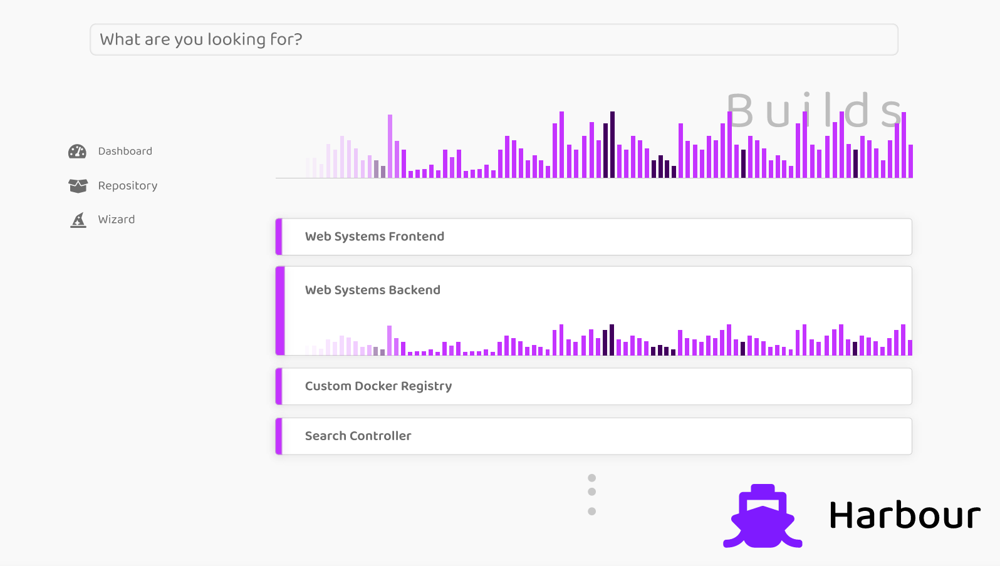
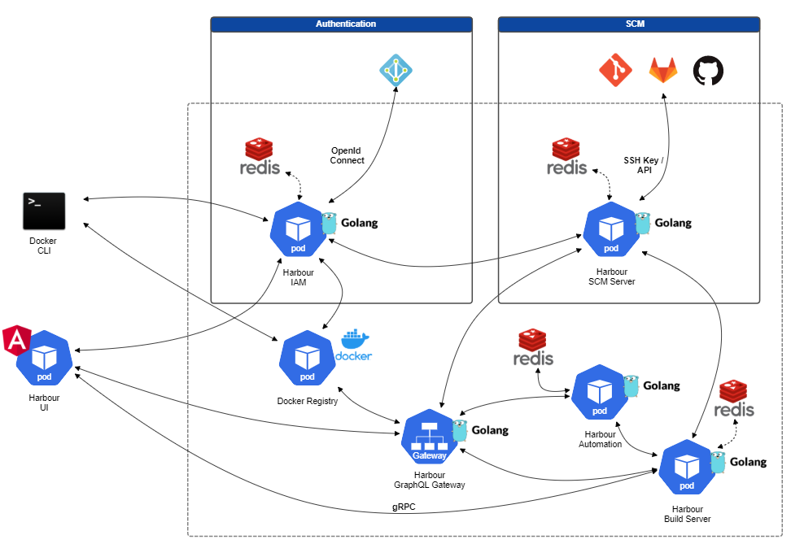

# Harbour.rocks
Harbour is a docker registry including build system focused on cloud native environments.

# Architecture

harbour.rocks is composed of several **Golang microservices**. It utilizes **Redis** as database and supports various **OpenId Connect** authentication provider.

# Development

##  Redis

**Version:** 5+

Harbour stores its data in the key-value database [Redis](https://redis.io/).

To run a development redis database you can use the docker-compose file provided here [deployments/redis/docker-compose.yml](deployments/redis/docker-compose.yml).

There is also a script to quickly run a redis instance [scripts/run-redis.sh](scripts/run-redis.sh).

`./scripts/run-redis.sh`

You can access redis for debugging purposes by the redis-cli using the following script [scripts/redis-cli.sh](scripts/redis-cli.sh).

`./scripts/redis-cli.sh`

# Docker Registry API

* List all repositories
  * /v2/_catalog
* List all tags (images inside a repository)
  * /v2/<name>/tags/list
  
https://docs.docker.com/registry/spec/api/#detail

# Licenses

## Font Awesome

The project, application, website including our harbour.rocks organizational logo uses Font Awesome licensed under https://fontawesome.com/license. There were no modifications made. Thank you Font Awesome for providing a wide variety of free icons!
